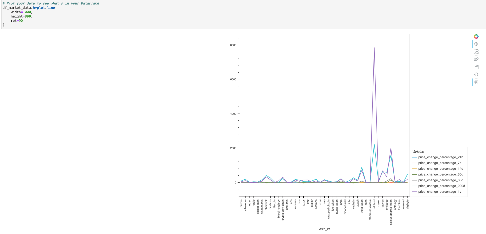
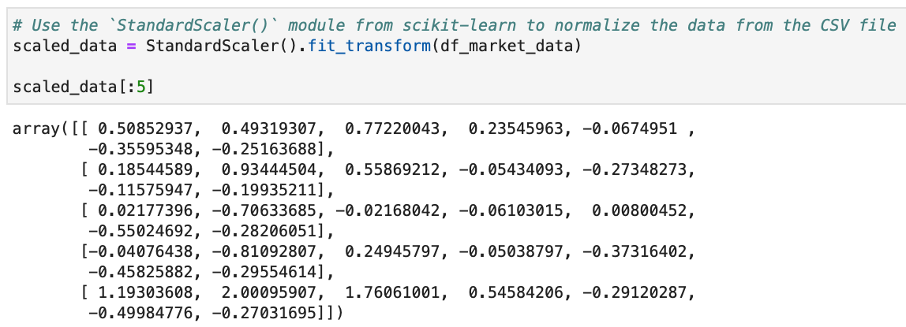
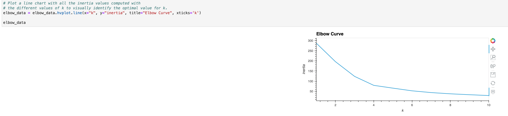
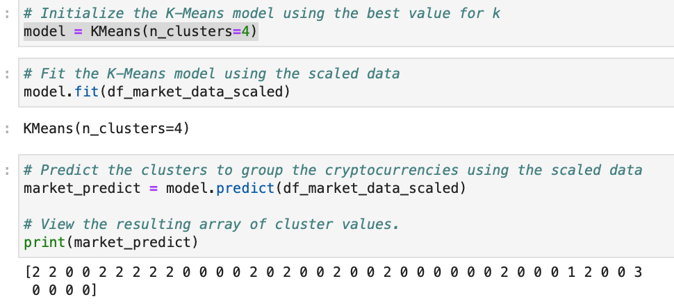
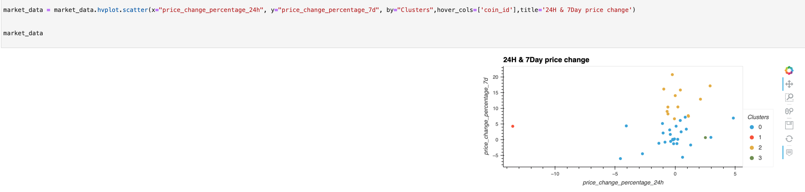
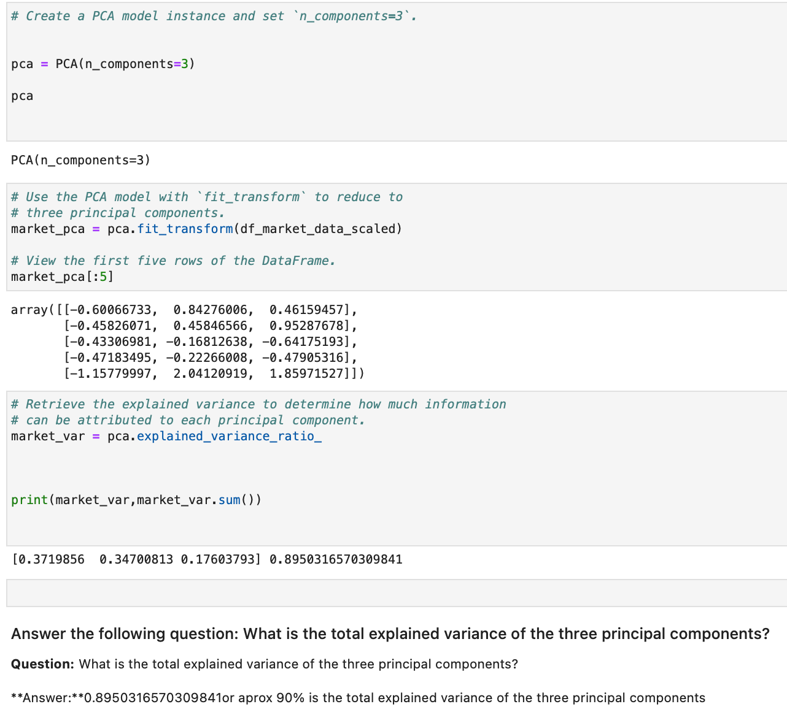
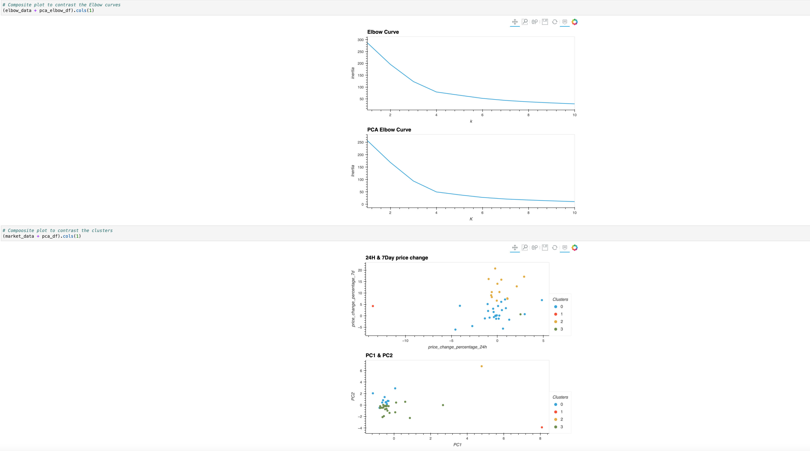

`Unsupervised Learning` *As an advisor in one of the topfive financial advisory firms in the world. Competitors are fierce, so you want to propose a novel approach to assembling investment portfolios that are based on cryptocurrencies.* Instead of basing your proposal on only **returns and volatility**, you want to include other factors that might impact the crypto market—leading to better performance for your portfolio. You’ll create a Jupyter notebook that **clusters cryptocurrencies** by their performance in different time periods. *You’ll then plot the results so that you can visually show the performance to the board.*
   
 # Resources   
 
 * 👨🏿‍⚖️ [Click here](https://www.ibm.com/cloud/learn/unsupervised-learning) to learn more about Unsupervised Learning

 * 👨🏿‍⚖️ [Click here](https://towardsdatascience.com/understanding-k-means-clustering-in-machine-learning-6a6e67336aa1) to learn more about K-means Clustering

# K-means Clustering

 > **Below is the Dataset that will be used for task**  

# STEP 1
 ## Prepare Data 
  
  

 > 👨🏿‍⚖️ *We use Standard Scaler to not have **bias** in Analysis*
   
   👨🏿‍⚖️ [Click here](https://thecleverprogrammer.com/2020/09/22/standardscaler-in-machine-learning/) to learn more about Standard Scaler

# STEP 2
  ## Find the Best Value for k Using the Original Data

  

 > 👨🏿‍⚖️[Click here](https://medium.com/@matthew.dicicco38/elbow-method-explained-e8736cfcc5d1) to learn more about Elbow Method

# STEP 3
 ## Cluster Cryptocurrencies with K-means Using the Original Data

 

 

# STEP 4
 ## Optimize Clusters with Principal Component Analysis

 

 > 👨🏿‍⚖️ Aprox 90% is the total explained variance of the three principal components
   
   👨🏿‍⚖️ [Click here](https://www.keboola.com/blog/pca-machine-learning) to learn more about PCA
     
# STEP 5
 ## Visualize and Compare Results

 

# REQUIREMENTS
  >👨🏿‍⚖️ Click name to downlaod

[Python](https://www.python.org/ftp/python/3.10.5/python-3.10.5-macos11.pkg)

[Jupyter Lab](https://jupyterlab.readthedocs.io/en/stable/getting_started/installation.html)

[Hvplot](https://pypi.org/project/hvplot/)

[Scikit-Learn](https://scikit-learn.org/stable/install.html)

# INSTALLATION

>👨🏿‍⚖️ INSTALL ZIP FILE OR CLONE REPO

[click here](https://github.com/brprod8/Unsupervised-Learning/archive/refs/heads/main.zip) for zip file

[click here](https://github.com/brprod8/Unsupervised-Learning) to clone repo

# LICENSE
**Open to Experiment**

BY:ROBERT SMITH

CREDIT: UC BERKELEY

EMAIL - Brprod8@gmail.com for Colloboration 

